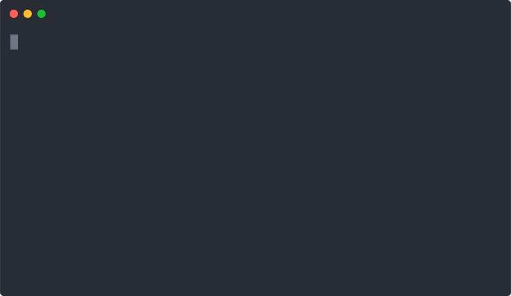

<h1 align="center">
  Fast Node Manager (<code>fnm</code>)
  
  <a href="https://github.com/Schniz/fnm/actions"></a>
</h1>

> :rocket: Fast and simple Node.js version manager, built in Rust

<div align="center">
  
</div>

## Features

:earth_americas: Cross-platform support (macOS, Windows, Linux)

:sparkles: Single file, easy installation, instant startup

:rocket: Built with speed in mind

:thinking: Works with `.node-version` and `.nvmrc` files

## Installation

### Using a script (macOS/Linux)

For `bash`, `zsh` and `fish` shells, there's an [automatic installation script](./.ci/install.sh):

```sh
sh -c "$(curl -fsSL https://fnm.vercel.app/install)"
```

#### Upgrade

On macOS, it is as simple as `brew upgrade fnm`.

On other operating systems, upgrading `fnm` is almost the same as installing it. To prevent duplication in your shell config file add `--skip-shell` to install command.

#### Parameters

`--install-dir`

Set a custom directory for fnm to be installed. The default is `$HOME/.fnm`.

`--skip-shell`

Skip appending shell specific loader to shell config file, based on the current user shell, defined in `$SHELL`. e.g. for Bash, `$HOME/.bashrc`. `$HOME/.zshrc` for Zsh. For Fish - `$HOME/.config/fish/conf.d/fnm.fish`

`--force-install`

macOS installations using the installation script are deprecated in favor of the Homebrew formula, but this forces the script to install using it anyway.

Example:

```sh
sh -c "$(curl -fsSL https://fnm.vercel.app/install)" -- --install-dir "./.fnm" --skip-shell
```

### Manually

#### Using Homebrew (macOS/Linux)

```sh
brew install fnm
```

Then, [set up your shell for fnm](#shell-setup)

#### Using Scoop (Windows)

```sh
scoop install fnm
```

Then, [set up your shell for fnm](#shell-setup)

#### Using Cargo (Linux/macOS/Windows)

```sh
cargo install fnm
```

Then, [set up your shell for fnm](#shell-setup)

#### Using a release binary (Linux/macOS/Windows)

- Download the [latest release binary](https://github.com/Schniz/fnm/releases) for your system
- Make it available globally on `PATH` environment variable
- Configure your shell profile:

### Removing
To remove fnm (😢), just delete the `.fnm` folder in your home directory. You should also edit your shell configuration to remove any references to fnm (ie. read [Shell Setup](#shell-setup), and do the opposite).

## Completions

fnm ships its completions with the binary:

```sh
fnm completions --shell <SHELL>
```

Where `<SHELL>` can be one of the supported shells:

- `bash`
- `zsh`
- `fish`
- `powershell`

Please follow your shell instructions to install them.

### Shell Setup

fnm needs to run some shell commands before you can start using it.
This is done by evaluating the output of `fnm env`. Check out the following guides for the shell you use:

#### Bash

add the following to your `.bashrc` profile:

```bash
eval "$(fnm env)"
```

#### Zsh

add the following to your `.zshrc` profile:

```zsh
eval "$(fnm env)"
```

#### Fish shell

create `~/.config/fish/conf.d/fnm.fish` add this line to it:

```fish
fnm env | source
```

#### PowerShell

Before adding any configuration to your shell, you'd need to enable symlink support for a standard accounts (non-administrator).

You can do it by enabling [Developer Mode](https://docs.microsoft.com/en-us/windows/apps/get-started/enable-your-device-for-development), or [updating the Local Security Policy](#local-security-policy).

##### Local Security Policy

Open `Local Security Policy` (`secpol.msc`) and go to `Local Policies` -> `User Rights Assignment`, select `Create symbolic links`, add your user to the list and **reboot**.

> Use `whoami` if you are not sure what's your user name.

Add the following to the end of your profile file:

```powershell
fnm env --use-on-cd | Out-String | Invoke-Expression
```

- On Windows, the profile is located at `~\Documents\PowerShell\Microsoft.PowerShell_profile.ps1` or `$PROFILE`
- For macOS/Linux, the profile is located at `~/.config/powershell/Microsoft.PowerShell_profile.ps1`

#### Windows Command Prompt aka Batch aka WinCMD

fnm is also supported but is not entirely covered. [You can set up a startup script](https://superuser.com/a/144348) and append the following line:

```batch
FOR /f "tokens=*" %i IN ('fnm env --use-on-cd') DO CALL %i
```
⚠️ If you get the error `i was unexpected at this time`, please make a .cmd file as suggested by the first step in the Usage with Cmder secton add it's path to the `AutoRun` registry key.

#### Usage with Cmder

Usage is very similar to the normal WinCMD install, apart for a few tweaks to allow being called from the cmder startup script. The example **assumes** that the `CMDER_ROOT` environment variable is **set** to the **root directory** of your Cmder installation.  
Then you can do something like this:

- Make a .cmd file to invoke it
```batch
:: %CMDER_ROOT%\bin\fnm_init.cmd
@echo off
FOR /f "tokens=*" %%z IN ('fnm env --use-on-cd') DO CALL %%z
```
- Add it to the startup script
```batch
:: %CMDER_ROOT%\config\user_profile.cmd
call "%CMDER_ROOT%\bin\fnm_init.cmd"
```
You can replace `%CMDER_ROOT%` with any other convenient path too.

## [Usage](./docs/commands.md)

[See the available commands for an extended usage documentation](./docs/commands.md)

## Contributing

PRs welcome :tada:

### Developing:

```sh
# Install Rust
git clone https://github.com/Schniz/fnm.git
cd fnm/
cargo build
```

### Running Binary:

```sh
cargo run -- --help # Will behave like `fnm --help`
```

### Running Tests:

```sh
cargo test
```
