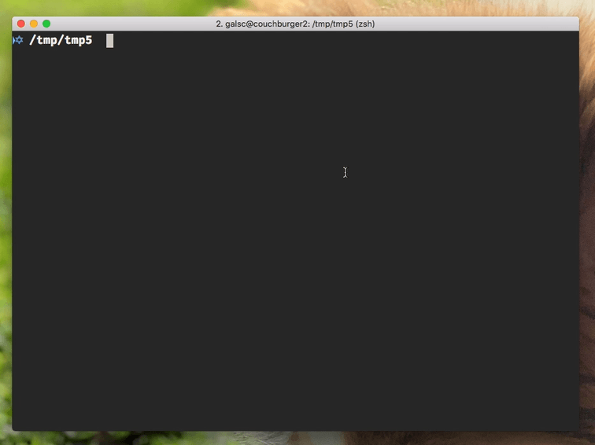

<h1 align="center">
  Fast Node Manager (<code>fnm</code>) <a href="https://dev.azure.com/galstar0385/fnm/_build/latest?definitionId=1?branchName=master"></a>
</h1>

> A blazing fast and simple `nvm` replacement, built in native ReasonML. :rocket:

<div align="center">
  
</div>

## Features
- Single file, easy installation :sparkles:
- Fast fast fast fast :rocket:
- Install multiple node versions without a hassle! :clap:
- [Project-specific `.nvmrc` file support](./features_tests/nvmrc)

## Installation

* Download the [latest release binary](https://github.com/Schniz/fnm/releases) for your system
* Make it available globally on `$PATH`
* Add the following line to your `.bashrc`/`.zshrc` file:

  ```bash
  eval `fnm env`
  ```

## TODO
- [ ] Feature: make versions complete the latest: `10` would infer the latest minor and patch versions of node 10. `10.1` would infer the latest patch version of node 10.1
- [ ] Feature: `fnm use --install`, `fnm use --quiet`
- [ ] Feature: `fnm install lts`?
- [ ] Feature: `fnm alias`?
- [ ] Feature: Consider nvm-like per-shell usage with symlinks on `/tmp` directory
- [ ] OSX: Add to homebrew?
- [ ] Windows Support?
- [ ] Linux: Replace `curl` usage with `cohttp`/`ocurl` or something else which is statically-linkable
- [ ] Linux: Replace `tar` with a statically linked library too (for ungzip + untar)

## Developing:

```
npm install -g esy
git clone https://github.com/Schniz/fnm.git
esy install
esy build
```

## Running Binary:

After building the project, you can run the main binary that is produced.

```
esy x fnm.exe
```

## Running Tests:

```
# Runs some smoke-unity test
esy test

# Runs the feature tests
feature_tests/run.sh
```
